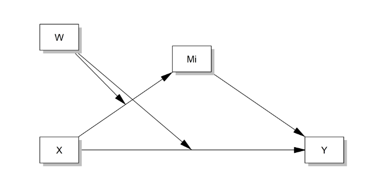

# Literature Reviews {#review}

## Introduction

Knowledge sharing is vital for gaining a competitive advantage as a unique, valuable, and critical resource. [@Ikujiro1995] Since the essential measure to improve the effectiveness of knowledge sharing lies in the design of effective knowledge-sharing incentives, motivation is the basis for the design of incentives. Therefore, knowledge-sharing motivation has attracted widespread academic interest increasingly. The current study findings lack systematicity, which is not conducive to grasping knowledge-sharing motivation issues at a holistic level and restricts the ability of organizations to manage employees' knowledge-sharing behavior. This study attempts to clarify the theoretical framework of knowledge-sharing motivation by comprehensively reviewing the literature of scholars and abroad to provide helpful guidance and inspiration for subsequent studies.

我经过大量的文献调研，得出如下表格，见表 \@ref(tab:tabreview)

```{r, tab.id = "tabreview"}
epp <- readxl::read_excel("./data/review.xlsx")
epp |> 
  flextable::flextable() |> 
  flextable::set_caption("文献重视")
```


## Literature Reviews 
关于自变量和因变量的概念史的梳理


## Theory of
关于解释自变量与因变量关系的理论回顾


## Research Relevant 
关于研究方法的回顾


## Conceptual Framework 概念架构图

概念架构图见 \@ref(fig:figconcept)，这里我需要啰嗦两句，巴拉巴拉

```{r figconcept, echo=FALSE, fig.cap = "文章概念架构图"}

```

\newpage